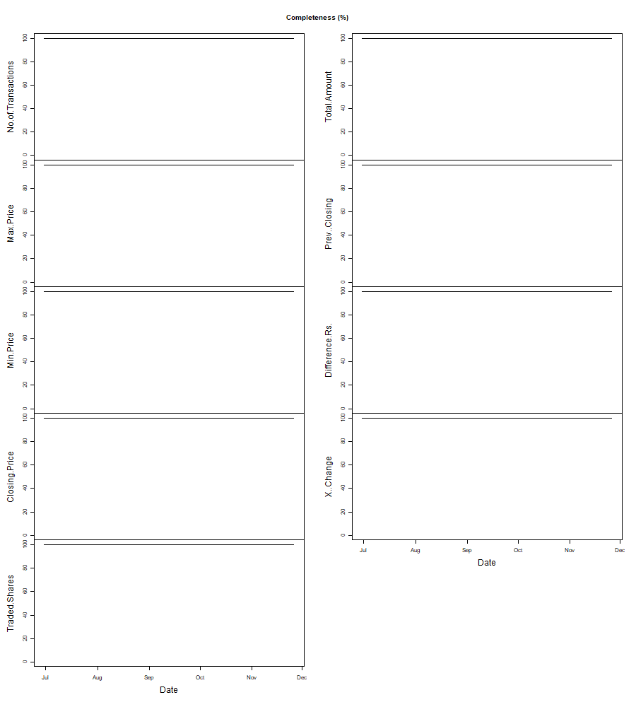
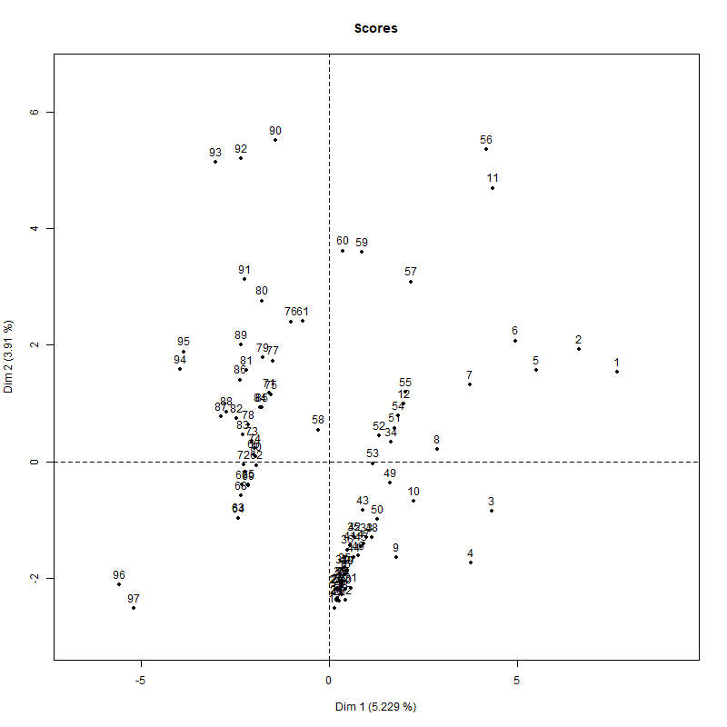

# Practice-data-quality

## Project Overview:

- Data quality ensures data is fit for consumption and meets the needs of data consumers. 
- Measured data quality through dimensions including completeness, consistency, integrity, reasonability, timelines, uniqueness, format, validity, and accessibility to ensure that they can be used for re- porting or further computation

## Code and Resources used:
**R:** 4.4.4.

**Packages Used:**  validate,dcmodify,zoo,PCAmixdata

## Data Completeness(function):

- Completeness relates to whether all required information is present in the dataset i.e data with no NA values.
- Used function completenessbycolumn in assessing this dimension to get the percentage of records that are complete.

It can be senn that dataset is 100% complete which mean there are no NA vales present in this dataset.

## Data Validity(validate,dcmodify):

- Data is characterized as valid if it matches the rules specified for it.
- Rules fixed for this dataset includes specifications such as

V2: data[["Max.Price"]] > data[["Min.Price"]]
 
V3: all_unique(data[["Date"]])

V4: data[["Min.Price"]] < data[["Max.Price"]]
 
- Errors can often be detected and repairedusing rule-basedprocessing. I have used the dcmodifypackage to formulate such rules and apply them to data.

M1: 
  if (Closing.Price - Prev..Closing != Difference.Rs.) Difference.Rs. <- Closing.Price - Prev..Closing

M4: 
  if (X..Change != (Difference.Rs./Prev..Closing) * 100) X..Change <- round(((data$Difference.Rs./data$Prev..Closing) * 100), digit = 2)
  
- Visualization of the effect of each intermediate step.I have used compare and cells to follow the changes in the data set as it is treated step by step.  The cells function is also part of validate.  It measures the number of changesby decomposing the number of cells in a data set into those that are available or not, andseparating those again into which are still available, have been removed, or are still missingwhen compared to a previous version of the data set.

performance of a dataset with respect to rule satisfaction as it gets processed step by step

changes in cell values as a data set gets processed step by step.

## Data understanding(PCAmix):
- Performs principal component analysis of a set of individuals (observations) described by a mixture of qualitative and quantitative variables. 
- PCA helps us to identify patterns in data based on the correlation between features. In a nutshell, PCA aims to find the directions of maximum variance in high-dimensional data and projects it onto a new subspace with equal or fewer dimensions than the original one.

